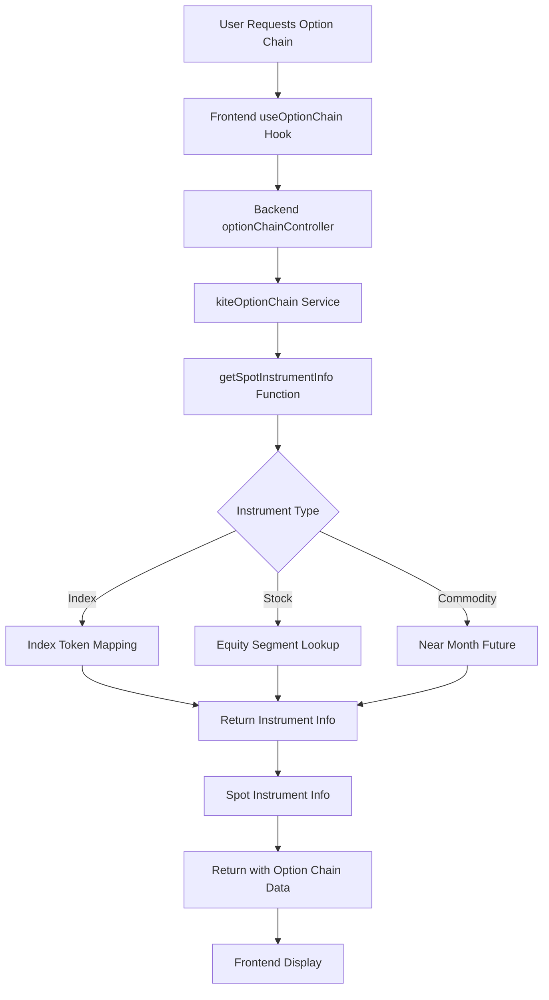
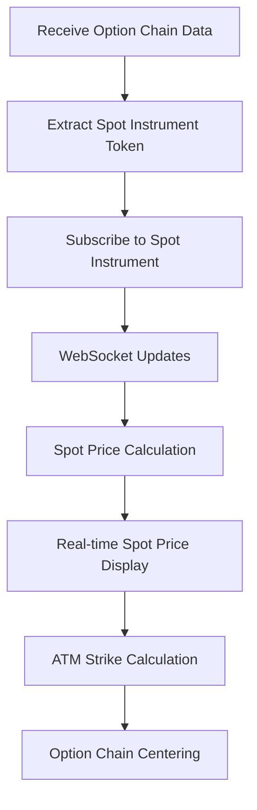

# Spot Price Real-Time Update Architecture Plan

## Overview
This plan outlines the modifications needed to enable real-time spot price updates in the option chain by having the backend return the instrument token for the spot price calculation, and letting the frontend subscribe to that token for real-time updates.

## Current Implementation Analysis

### Backend (`Backend/services/kiteOptionChain.js`)
1. The `getSpotPrice` function currently:
   - For indices: Uses `INDEX_UNDERLYING_MAP` to get a predefined token and fetches the price via `getKiteQuote`
   - For stocks: Queries the database for the equity instrument and fetches the price via `getKiteQuote`
   - For commodities: Finds the near month future contract and fetches the price via `getKiteQuote`

2. The `getOptionChain` function:
   - Calls `getSpotPrice` to get the current spot price
   - Returns the spot price in the response

### Frontend (`frontend/src/hooks/useOptionChain.js`)
1. Fetches option chain data including the spot price from the backend
2. Sets the spot price in state: `setSpotPrice(result.data.spotPrice)`
3. Only subscribes to option contracts for WebSocket updates
4. Does not subscribe to the underlying spot price instrument

## Proposed Modifications

### 1. Backend Modifications

#### A. Create a new function to get spot instrument info
We need to create a function that returns the instrument token instead of the price:

```javascript
/**
 * Get spot instrument info for an underlying
 * Handles indices, stocks, and MCX commodities
 * 
 * @param {string} underlyingName - e.g., "NIFTY", "HDFCBANK", "GOLD"
 * @param {string} segment - e.g., "NFO-OPT", "BFO-OPT", "MCX-OPT"
 * @returns {Promise<Object|null>} Spot instrument info or null if not found
 */
export async function getSpotInstrumentInfo(underlyingName, segment) {
    try {
        // 1. Check if it's a known INDEX
        const indexInfo = INDEX_UNDERLYING_MAP[underlyingName];
        if (indexInfo && indexInfo.token) {
            console.log(`[KiteOptionChain] Getting spot instrument for index: ${underlyingName} -> token ${indexInfo.token}`);
            return {
                token: indexInfo.token,
                type: 'index',
                tradingsymbol: indexInfo.tradingsymbol,
                exchange: indexInfo.exchange
            };
        }

        // 2. For STOCK OPTIONS (NFO-OPT/BFO-OPT), get equity instrument info
        const equitySegment = OPTION_TO_EQUITY_SEGMENT[segment];
        if (equitySegment) {
            console.log(`[KiteOptionChain] Getting spot instrument for stock: ${underlyingName} in ${equitySegment}`);
            const stock = await Instrument.findOne({
                tradingsymbol: underlyingName,
                segment: equitySegment
            }).lean();

            if (stock) {
                return {
                    token: stock.instrument_token,
                    type: 'stock',
                    tradingsymbol: stock.tradingsymbol,
                    exchange: stock.exchange,
                    lot_size: stock.lot_size
                };
            }
        }

        // 3. For MCX (Commodities) - use near month future as spot reference
        if (segment && segment.startsWith('MCX')) {
            console.log(`[KiteOptionChain] Getting spot instrument for MCX: ${underlyingName} from near month future`);
            const nearFuture = await Instrument.findOne({
                name: underlyingName,
                segment: 'MCX-FUT',
                expiry: { $gte: new Date() }
            }).sort({ expiry: 1 }).lean();

            if (nearFuture) {
                return {
                    token: nearFuture.instrument_token,
                    type: 'commodity_future',
                    tradingsymbol: nearFuture.tradingsymbol,
                    exchange: nearFuture.exchange,
                    lot_size: nearFuture.lot_size
                };
            }
        }

        console.warn(`[KiteOptionChain] Could not find spot instrument for: ${underlyingName} (${segment})`);
        return null;

    } catch (error) {
        console.error('[KiteOptionChain] Error getting spot instrument info:', error.message);
        return null;
    }
}
```

#### B. Modify `getOptionChain` function to return spot instrument info
Update the `getOptionChain` function to return the spot instrument info instead of the spot price:

```javascript
/**
 * Build option chain data for an underlying and expiry
 * 
 * @param {string} underlyingName - e.g., "NIFTY", "HDFCBANK"
 * @param {string} segment - e.g., "NFO-OPT", "BFO-OPT"
 * @param {string} expiry - Expiry date in YYYY-MM-DD format
 * @returns {Promise<Object>} Option chain data with spotInstrumentInfo and chain array
 */
export async function getOptionChain(underlyingName, segment = 'NFO-OPT', expiry) {
    try {
        console.log(`[KiteOptionChain] Building chain for: ${underlyingName} (${segment}) expiry: ${expiry}`);

        // Parse expiry date for range query (to handle timezone differences)
        const expiryDate = new Date(expiry);
        const expiryStart = new Date(expiryDate);
        expiryStart.setHours(0, 0, 0, 0);
        const expiryEnd = new Date(expiryDate);
        expiryEnd.setHours(23, 59, 59, 999);

        // Query all options for this underlying and expiry
        const options = await Instrument.find({
            name: underlyingName,
            segment: segment,
            expiry: { $gte: expiryStart, $lte: expiryEnd },
            instrument_type: { $in: ['CE', 'PE'] }
        }).lean();

        if (!options || options.length === 0) {
            console.warn(`[KiteOptionChain] No options found for ${underlyingName} ${expiry}`);
            return { chain: [], spotInstrumentInfo: null, totalStrikes: 0 };
        }

        console.log(`[KiteOptionChain] Found ${options.length} option contracts`);

        // Group by strike price
        const strikeMap = new Map();

        for (const opt of options) {
            const strike = opt.strike;
            if (!strikeMap.has(strike)) {
                strikeMap.set(strike, { strike, call: null, put: null });
            }

            const row = strikeMap.get(strike);
            const optionData = {
                instrument_token: opt.instrument_token,
                tradingsymbol: opt.tradingsymbol,
                lot_size: opt.lot_size,
                tick_size: opt.tick_size,
                ltp: 0, // Will be populated by frontend via WebSocket
                oi: 0,
                volume: 0,
            };

            if (opt.instrument_type === 'CE') {
                row.call = optionData;
            } else if (opt.instrument_type === 'PE') {
                row.put = optionData;
            }
        }

        // Convert map to sorted array
        const chain = Array.from(strikeMap.values())
            .sort((a, b) => a.strike - b.strike);

        // Get spot instrument info
        const spotInstrumentInfo = await getSpotInstrumentInfo(underlyingName, segment);

        console.log(`[KiteOptionChain] Built chain with ${chain.length} strikes, spot instrument:`, spotInstrumentInfo);

        return {
            chain,
            spotInstrumentInfo, // Changed from spotPrice to spotInstrumentInfo
            totalStrikes: chain.length
        };

    } catch (error) {
        console.error('[KiteOptionChain] Error building option chain:', error.message);
        throw error;
    }
}
```

#### C. Update the controller to return spot instrument info
Modify `Backend/Controllers/optionChainController.js` to return the spot instrument info:

```javascript
// In the getOptionChain function, change:
// OLD:
// spotPrice: optionChainData.spotPrice,

// NEW:
spotInstrumentInfo: optionChainData.spotInstrumentInfo,
```

### 2. Frontend Modifications

#### A. Update the useOptionChain hook to handle spot instrument info
Modify `frontend/src/hooks/useOptionChain.js` to:

1. Receive the spot instrument info instead of the spot price
2. Subscribe to the spot instrument token
3. Calculate the spot price from WebSocket updates

```javascript
// Add state for spot instrument info
const [spotInstrumentInfo, setSpotInstrumentInfo] = useState(null);

// Update the fetchOptionChain function to handle spotInstrumentInfo
const fetchOptionChain = useCallback(async () => {
    // ... existing code ...

    try {
        // ... existing code ...

        const result = await response.json();
        console.log('[useOptionChain] Received data:', {
            totalStrikes: result.data?.chain?.length,
            spotInstrumentInfo: result.data?.spotInstrumentInfo, // Changed from spotPrice
            expiry: result.data?.expiry
        });

        setChainData(result.data.chain);
        setSpotInstrumentInfo(result.data.spotInstrumentInfo); // Changed from setSpotPrice
        setSpotPrice(null); // Reset spot price until we get WebSocket update

        // ... existing code ...
    }

    // ... existing code ...
}, [name, segment, expiry]);

// Update the initial fetch effect to subscribe to spot instrument
useEffect(() => {
    if (!name) return;

    // Unsubscribe from previous subscriptions
    unsubscribeFromOptionStrikes();

    fetchOptionChain().then(data => {
        if (data?.chain && isConnected) {
            subscribeToOptionStrikes(data.chain);
            
            // NEW: Subscribe to spot instrument if available
            if (data.spotInstrumentInfo?.token) {
                subscribe([{ instrument_token: data.spotInstrumentInfo.token }], 'ticker');
            }
        }
    });

    fetchExpiries();

    // Cleanup on unmount or param change
    return () => {
        unsubscribeFromOptionStrikes();
        // NEW: Unsubscribe from spot instrument if needed
        if (spotInstrumentInfo?.token) {
            unsubscribe([{ instrument_token: spotInstrumentInfo.token }], 'ticker');
        }
    };
}, [name, segment, expiry, isConnected, fetchOptionChain, fetchExpiries, subscribeToOptionStrikes, unsubscribeFromOptionStrikes, spotInstrumentInfo]);

// Update the return value to include spotInstrumentInfo
return {
    chainData,
    spotPrice, // This will now be updated via WebSocket
    spotInstrumentInfo, // NEW: Expose spot instrument info
    expiries,
    loading,
    error,
    refetch: fetchOptionChain,
};
```

#### B. Add spot price calculation from WebSocket updates
Add a new effect to handle spot price updates from WebSocket:

```javascript
// Add after the existing updateLoop effect
useEffect(() => {
    if (!spotInstrumentInfo?.token) return;

    let animationFrameId;
    let lastUpdate = 0;
    const THROTTLE_MS = 50; // Update UI max 20 times per second

    const spotUpdateLoop = (timestamp) => {
        // Throttle checks
        if (timestamp - lastUpdate < THROTTLE_MS) {
            animationFrameId = requestAnimationFrame(spotUpdateLoop);
            return;
        }

        const ticks = ticksRef.current;
        if (!ticks.size) {
            animationFrameId = requestAnimationFrame(spotUpdateLoop);
            return;
        }

        // Check for spot instrument updates
        const spotTick = ticks.get(String(spotInstrumentInfo.token));
        if (spotTick?.ltp !== undefined && spotTick.ltp > 0) {
            if (spotPrice !== spotTick.ltp) {
                setSpotPrice(spotTick.ltp);
                lastUpdate = timestamp;
            }
        }

        animationFrameId = requestAnimationFrame(spotUpdateLoop);
    };

    // Start the loop
    animationFrameId = requestAnimationFrame(spotUpdateLoop);

    return () => {
        cancelAnimationFrame(animationFrameId);
    };
}, [spotInstrumentInfo, spotPrice, ticksRef]);
```

### 3. Data Flow After Modifications

#### Backend Data Flow


#### Frontend Data Flow


## Benefits of This Approach

1. **Real-time Updates**: Spot price will update in real-time via WebSocket just like option LTPs
2. **Reduced Backend Load**: No need to repeatedly fetch spot prices from Kite API
3. **Consistent Architecture**: Uses the same WebSocket subscription model as option contracts
4. **Better Performance**: Eliminates the 5-second refresh interval for spot price
5. **Scalability**: More efficient for handling multiple concurrent users

## Implementation Steps

1. **Step 1**: Create `getSpotInstrumentInfo` function in `kiteOptionChain.js`
2. **Step 2**: Modify `getOptionChain` function to use `getSpotInstrumentInfo`
3. **Step 3**: Update `optionChainController.js` to return `spotInstrumentInfo`
4. **Step 4**: Modify `useOptionChain.js` to handle spot instrument info
5. **Step 5**: Add WebSocket subscription for spot instrument
6. **Step 6**: Implement spot price calculation from WebSocket updates
7. **Step 7**: Test real-time updates
8. **Step 8**: Verify existing functionality remains intact

## Testing Plan

1. **Unit Tests**:
   - Test `getSpotInstrumentInfo` function with different instrument types
   - Verify correct instrument tokens are returned

2. **Integration Tests**:
   - Test option chain API returns spot instrument info
   - Verify frontend receives and processes spot instrument info

3. **End-to-End Tests**:
   - Verify real-time spot price updates in option chain
   - Confirm ATM strike calculation works with real-time updates
   - Ensure option LTPs continue to update correctly

4. **Performance Tests**:
   - Monitor WebSocket message frequency
   - Verify no increase in server load
   - Check UI responsiveness with real-time updates

## Rollback Plan

If issues arise, we can rollback by:
1. Reverting the backend changes to restore `getSpotPrice` function
2. Reverting the controller to return `spotPrice` instead of `spotInstrumentInfo`
3. Reverting the frontend hook to use spot price from backend
4. Removing WebSocket subscription for spot instrument